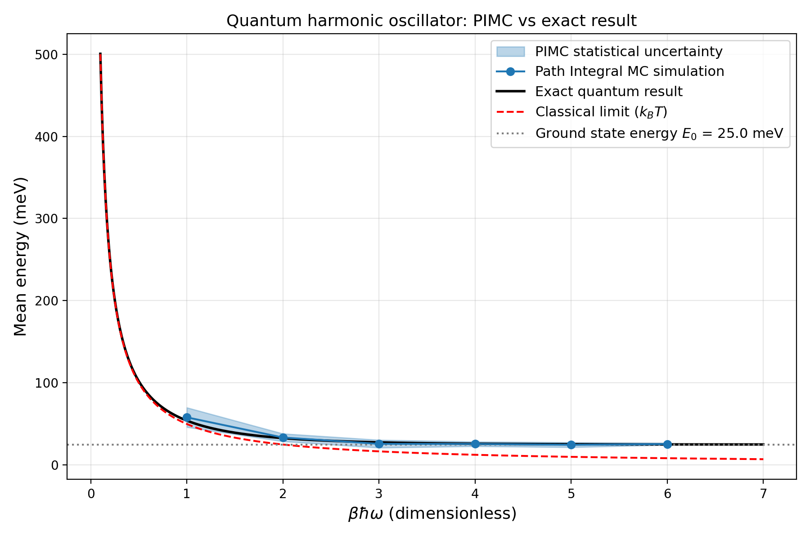
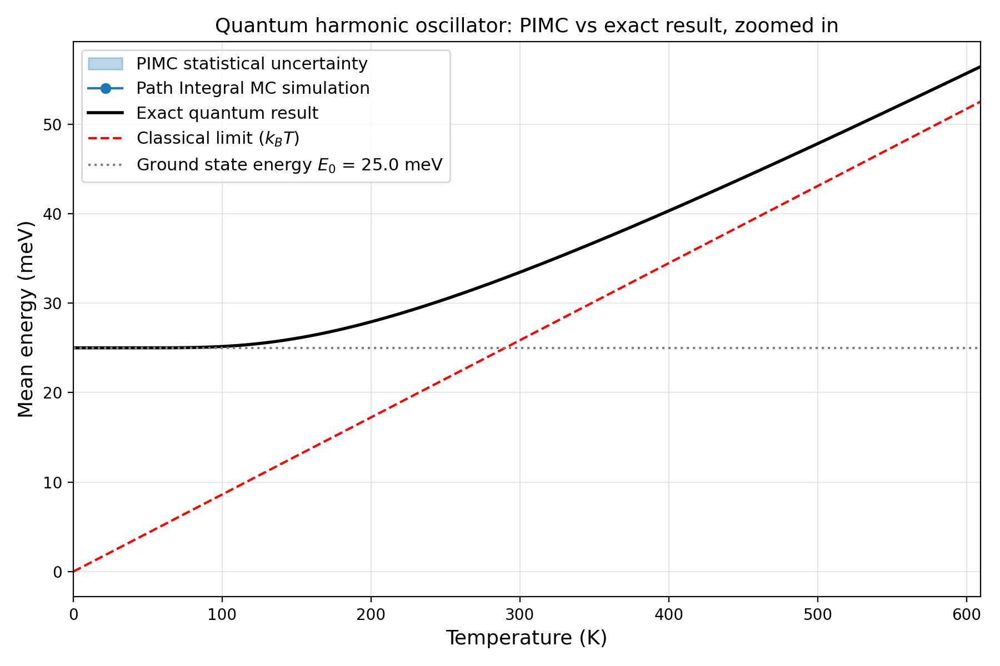
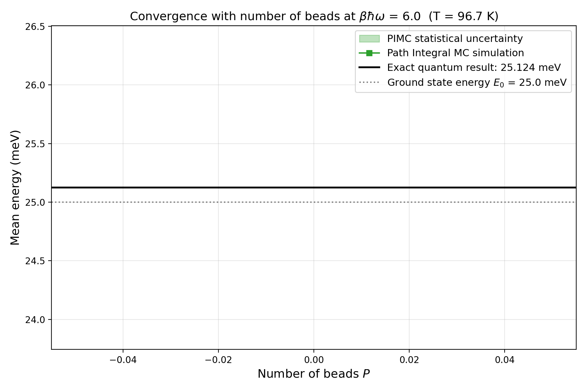
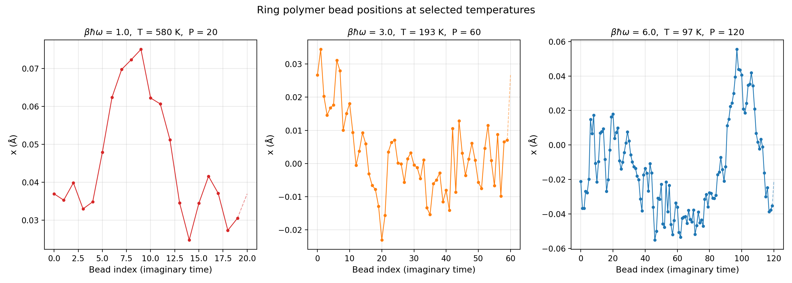

# final-project---path-integral-MC

# Path Integral Monte Carlo: Quantum Harmonic Oscillator
Gaya Zucker
### Final Project Summary
**System:** Single Ar atom in a 1D harmonic trap, $\hbar\omega = 50$ meV

## 1. Which Advanced Method Did I Choose?

For this project I chose to implement Path Integral Monte Carlo (PIMC). The idea behind it is to use Feynman's path integral formulation of quantum mechanics in order to compute thermodynamic properties of quantum systems — things that a standard classical simulation simply cannot get right.

Specifically, I simulated a single argon atom ($m = 39.948$ u) trapped in a one-dimensional harmonic potential with $\hbar\omega = 50$ meV. I computed the mean total energy $\langle E \rangle$ as a function of inverse temperature $\beta = 1/k_BT$ for $\beta\hbar\omega \in \{1, 2, 3, 4, 5, 6\}$, and compared my results against the exact analytical solution at each temperature.
## 2. What Problem Does PIMC Solve?

Throughout this course, the MD and MC codes I implemented were fundamentally classical — they sampled from the Boltzmann distribution $e^{-\beta H}$ where $H$ was treated as a classical Hamiltonian. This works fine at high temperatures, but it completely misses quantum mechanical effects that become important at low temperatures, such as:

- **Zero-point energy**: a quantum harmonic oscillator has a ground state energy $E_0 = \hbar\omega/2 > 0$ even at absolute zero. A classical simulation predicts $E \to 0$ as $T \to 0$, which is simply wrong.
- **Quantum delocalization**: a quantum particle is not a point — it has a spatial spread even in its ground state, described by its wavefunction.
- **The quantum-to-classical crossover**: as temperature increases, quantum effects gradually wash out and the system approaches the classical limit.

For the harmonic oscillator, the exact quantum result for the thermal average energy is:
$$\langle E \rangle = \frac{\hbar\omega}{2}\coth\left(\frac{\beta\hbar\omega}{2}\right)$$

This saturates to $E_0 = 25$ meV at low temperature, while the classical equipartition result $\langle E \rangle = k_BT$ goes to zero. The crossover temperature for this system is $T^* = \hbar\omega/k_B \approx 580$ K — below this, quantum effects matter and a classical simulation will give wrong answers. PIMC correctly captures the quantum result at all temperatures.
## 3. How Does the Algorithm Work?

### 3.1 The Path Integral Mapping

The central idea, originally due to Feynman (1972), is that the quantum partition function
$$Z = \mathrm{Tr}\, e^{-\beta H}$$
can be rewritten as a path integral over imaginary-time trajectories. To make this computationally useful, the density matrix is factorized using the Trotter approximation, which becomes exact at high temperature:
$$\rho(x, x', \beta) \approx e^{-\frac{1}{2}\beta V(x)}\,\rho_\mathrm{free}(x,x',\beta)\,e^{-\frac{1}{2}\beta V(x')}$$

By inserting $P-1$ complete sets of position states and using this approximation at each step, the partition function becomes:
$$Z_P = \left(\frac{mP}{2\pi\beta\hbar^2}\right)^{P/2} \int dx_0\cdots dx_{P-1}\; e^{-\beta U_\mathrm{eff}(\{x_k\})}$$
where the effective classical potential is:
$$U_\mathrm{eff} = \sum_{k=0}^{P-1}\left[\frac{1}{2}m\omega_P^2(x_{k+1}-x_k)^2 + \frac{1}{P}V(x_k)\right]$$
with $\omega_P = \sqrt{P}/(\beta\hbar)$ and periodic boundary conditions $x_P = x_0$.

What this says is that a single quantum particle is equivalent to a classical ring polymer — a ring made of $P$ beads connected by harmonic springs, each bead also feeling $1/P$ of the external potential. This mapping becomes exact as $P \to \infty$. I found this mapping genuinely surprising — it's not obvious at all that a quantum particle should behave like a classical polymer.

### 3.2 The Monte Carlo Sampling

Once the ring polymer picture is established, sampling it is straightforward using the Metropolis algorithm from earlier in the course. Each MC sweep attempts to move all $P$ beads one by one. For bead $k$, I proposed a random displacement drawn uniformly from $[-\delta_\mathrm{max}, +\delta_\mathrm{max}]$ and accepted it with probability $\min(1, e^{-\beta\Delta U_\mathrm{eff}})$. Crucially, only the two spring segments connecting bead $k$ to its neighbours $k-1$ and $k+1$ change when bead $k$ moves, so the energy update can be done in $O(1)$ per bead.

### 3.3 The Energy Estimator

The mean energy is estimated using the thermodynamic (primitive) estimator, obtained by differentiating $\ln Z_P$ with respect to $\beta$:
$$\langle E \rangle = \frac{P}{2\beta} - \frac{1}{2}m\omega_P^2\sum_{k=0}^{P-1}(x_{k+1}-x_k)^2 + \frac{1}{P}\sum_{k=0}^{P-1}V(x_k)$$

This is correct in expectation for any finite $P$, but as I discuss later, it has a significant variance problem.

### 3.4 Choosing the Number of Beads

The number of beads $P$ was set using the heuristic $P = 20 \times \beta\hbar\omega$, so that $P$ scales linearly with $\beta$. This keeps the Trotter error $O(1/P^2)$ roughly constant across temperatures. At the lowest temperature I simulated ($\beta\hbar\omega = 6$, $T = 96.7$ K), this gave $P = 120$ beads.
## 4. Simulation Results

All production runs used $N_\mathrm{steps} = 50{,}000$ MC sweeps per run, $N_\mathrm{indep} = 5$ independent simulations per temperature point, and a burn fraction of 30% (the first 30% of each run was discarded as equilibration). Statistical uncertainties are the standard deviation across independent runs.

The step size was initialized as $\delta_\mathrm{max} = 0.5\,\text{Å}/\sqrt{P}$ — scaled down for larger rings to account for the stiffer inter-bead springs — and adaptively tuned during the first quarter of each run to keep the acceptance ratio near 40–60%.

### 4.1 Energy vs $\beta\hbar\omega$ (Figure 1)

Figure 1 shows the mean PIMC energy as a function of $\beta\hbar\omega$, compared to the exact quantum result and the classical equipartition limit. For $\beta\hbar\omega \geq 2$, the simulation points tracked the exact curve quite closely, with tight error bands. This was encouraging because it showed the simulation was correctly capturing the quantum saturation of the energy toward the ground state value $E_0 = 25$ meV.

At $\beta\hbar\omega = 1$ (the highest temperature I simulated), the error bars were noticeably larger. This makes sense physically — at high temperature, the system is in the classical regime where many energy levels are populated, and the primitive estimator has higher variance because the $P/(2\beta)$ kinetic term becomes large.

The main takeaway from this figure is the clear separation between the quantum (black) and classical (red dashed) curves at large $\beta$: while the classical energy goes to zero, the PIMC correctly predicts that the energy flattens out at $E_0 = 25$ meV, reflecting the zero-point motion of the quantum particle.

### 4.2 Energy vs Temperature (Figure 2)

Figure 2 shows the same data plotted against temperature in Kelvin. The simulation points lay close to the exact quantum curve and remained above the ground state energy at all temperatures, as they physically should. Below roughly 300 K, the classical result (dashed red) diverges significantly from the quantum result, marking the onset of the quantum regime. The simulation captured this crossover correctly.

### 4.3 Bead Convergence (Figure 3)

Figure 3 shows how the computed energy varied with the number of beads $P$ at the lowest temperature ($\beta\hbar\omega = 6$, $T = 96.7$ K). Ideally, we would expect a smooth monotonic convergence toward the exact value of 25.124 meV as $P$ increases. In practice, the convergence was not perfectly monotonic — the points scattered within roughly $\pm 2$ meV of the exact value without a clean trend.

The exact result always fell within the statistical uncertainty band, so the simulation was consistent with the correct answer at every $P$. However, the scatter was larger than I would have liked. This is a known issue with the primitive estimator: both the $P/(2\beta)$ term and the spring energy term grow as $O(P)$, and the physical quantum kinetic energy only emerges from their difference, which is $O(\hbar\omega)$. This large cancellation amplifies statistical noise and makes it hard to see clean convergence without very long runs or a better estimator.

### 4.4 Ring Polymer Snapshots (Figure 4)

Figure 4 shows snapshots of the ring polymer bead positions along the imaginary time axis at three temperatures. The spread of bead positions grew noticeably as temperature decreased: at $T = 580$ K the ring was relatively compact, while at $T = 97$ K the beads spread over a much wider range of positions. This is exactly the physically expected results — the quantum delocalization of the particle increases as temperature decreases and zero-point motion dominates.
## 5. Implementation Challenges

Getting this simulation to work correctly turned out to be more involved than I initially expected. Several bugs and physical issues had to be resolved before the results made sense.

**Energy history not being collected:** The first and most embarrassing bug was an indentation error in the simulation loop: the line that stored the energy to the history list was placed outside the MC loop instead of inside it. This meant that at most one energy value was recorded per simulation regardless of how many steps were run, and the mean energy computed from it was meaningless. Once I fixed the indentation, the energy history started accumulating correctly and the figures immediately looked better.

**Step size for large rings:** Initially I used the same step size $\delta_\mathrm{max}$ for all values of $P$. For small rings this was fine, but for large rings (e.g. $P = 120$) the inter-bead spring constant $k_P = m\omega_P^2$ grows as $P$, making the beads much more tightly coupled. A step size that gave ~50% acceptance at $P = 20$ gave very low acceptance at $P = 120$, and the simulation effectively got stuck. I fixed this by scaling the initial step size as $\delta_\mathrm{max}/\sqrt{P}$ and adding an adaptive tuning scheme that adjusted $\delta_\mathrm{max}$ during the first quarter of the run.

**Equilibration for large rings:** Even with the correct step size, large rings equilibrated much more slowly than small ones because they have more degrees of freedom. Starting all beads at $x = 0$ (the potential minimum) worked fine for small $P$ but left large rings stuck near zero for thousands of steps. I resolved this by scaling the number of MC steps proportionally to $P$, so that large rings had enough time to equilibrate.

**Attempting the virial estimator:** At one point I tried to replace the primitive estimator with the virial estimator (Herman et al., 1982) to reduce the variance in the bead convergence plot. However, I made an error in the derivation and ended up with an estimator that systematically gave energies about half the correct value. After some debugging I reverted to the primitive estimator and accepted the higher variance as a known limitation of the method. 
## 6. Limitations of the Method

**Trotter error:** The ring polymer mapping is only exact in the limit $P \to \infty$. At finite $P$ there is a systematic error of $O((\beta\hbar\omega/P)^2)$ from the Trotter factorization. In practice, this means $P$ has to grow linearly with $\beta$, so simulating very low temperatures becomes increasingly expensive. Tuckerman (2010, Chapter 12) discusses this in detail.

**High variance of the primitive estimator:** As I found in practice, the primitive estimator has a variance that grows with $P$ due to the large cancellation between two $O(P)$ terms. This made it hard to demonstrate clean bead convergence without very long runs. This is a well-known problem and is the main motivation for developing the virial estimator.

**Slow sampling for large rings:** Local single-bead moves become increasingly inefficient as $P$ grows, because moving one bead while its neighbours are fixed is strongly constrained by the springs. The autocorrelation time of the Markov chain grows with $P$, requiring proportionally more steps to get statistically independent samples. I noticed this directly in the longer equilibration times needed for large $P$.

**The fermion sign problem:** The implementation here applies only to distinguishable particles (or bosons). For fermionic systems, the density matrix requires antisymmetrization, which introduces alternating signs in the path integral weights. At low temperature these signs cancel catastrophically, making the statistical error grow exponentially with system size and $\beta$ — the infamous fermion sign problem (Ceperley, 1996). This is one of the fundamental unsolved problems in quantum Monte Carlo.

**Real-time dynamics not accessible:** PIMC works in imaginary time, which gives access to thermodynamic equilibrium properties but not to real-time dynamical quantities like diffusion coefficients or vibrational spectra. Extending the method to real time leads to an oscillating phase problem analogous to the sign problem.
## 7. Possible Improvements

**Virial energy estimator:** The virial estimator (Herman, Bruskin and Berne, 1982) avoids the large cancellation of the primitive estimator. For a general potential $V(x)$ it reads:
$$\langle E \rangle_\mathrm{vir} = \frac{1}{2\beta} + \frac{1}{2P}\sum_{k=0}^{P-1}(x_k - \bar{x})\frac{\partial V}{\partial x_k} + \frac{1}{P}\sum_{k=0}^{P-1}V(x_k)$$
where $\bar{x} = (1/P)\sum_k x_k$ is the ring polymer centroid. The variance of this estimator does not grow with $P$, which would have given much cleaner bead convergence plots than I was able to produce with the primitive estimator. This is described in Tuckerman (2010, Chapter 12).

**Staging moves and the Lévy construction:** Instead of moving one bead at a time, staging moves (Sprik, Klein and Chandler, 1985) resample entire segments of the ring polymer simultaneously, using the free-particle density matrix as a proposal distribution — the so-called Lévy construction described in Krauth (2006, Chapter 3). This dramatically reduces autocorrelation times and is the standard approach in serious PIMC codes.

**Path Integral Molecular Dynamics (PIMD):** Rather than using random Monte Carlo moves, one can introduce fictitious momenta for each bead and propagate the ring polymer using molecular dynamics (Parrinello and Rahman, 1984). PIMD combined with thermostats such as the Path Integral Langevin Equation (PILE) scheme of Ceriotti, Parrinello, Markland and Manolopoulos (2010) is now the dominant approach in condensed-phase quantum simulations of molecules and materials.

**Higher-order Trotter decompositions:** The standard Trotter factorization has error $O(1/P^2)$. Higher-order decompositions (Suzuki, 1995; Chin, 1997) achieve $O(1/P^4)$ or better, meaning the same accuracy can be reached with significantly fewer beads and less computational effort.

**Ring Polymer Molecular Dynamics (RPMD):** Craig and Manolopoulos (2004) showed that the ring polymer's real-time dynamics, using the physical Hamiltonian for the beads, gives a reasonable approximation to quantum real-time correlation functions. This extends the ring polymer idea beyond equilibrium thermodynamics to dynamical properties like diffusion and reaction rates — something PIMC cannot do on its own.
## 8. References

- Feynman, R.P. (1972). *Statistical Mechanics: A Set of Lectures*. Benjamin/Cummings.
- Tuckerman, M.E. (2010). *Statistical Mechanics: Theory and Molecular Simulation*. Oxford University Press. Chapter 12.
- Krauth, W. (2006). *Statistical Mechanics: Algorithms and Computations*. Oxford University Press. Chapter 3.
- Ceriotti, M., Kapil, V., Litman, Y., Markland, T. and Rossi, M. *Booklet of the CECAM Flagship School on Path Integral Quantum Mechanics*. Sections 1–2.
- Herman, M.F., Bruskin, E.J. and Berne, B.J. (1982). On path integral Monte Carlo simulations. *Journal of Chemical Physics*, 76, 5150.
- Sprik, M., Klein, M.L. and Chandler, D. (1985). Staging: A sampling technique for the Monte Carlo evaluation of path integrals. *Physical Review B*, 31, 4234.
- Ceperley, D.M. (1996). Path integral Monte Carlo methods for fermions. *Monte Carlo and Molecular Dynamics of Condensed Matter Systems*.
- Parrinello, M. and Rahman, A. (1984). Study of an F center in molten KCl. *Journal of Chemical Physics*, 80, 860.
- Ceriotti, M., Parrinello, M., Markland, T.E. and Manolopoulos, D.E. (2010). Efficient stochastic thermostatting of path integral molecular dynamics. *Journal of Chemical Physics*, 133, 124104.
- Craig, I.R. and Manolopoulos, D.E. (2004). Quantum statistics and classical mechanics: Real time correlation functions from ring polymer molecular dynamics. *Journal of Chemical Physics*, 121, 3368.
- Suzuki, M. (1995). Hybrid exponential product formulas for unbounded operators with possible applications to Monte Carlo simulations. *Physics Letters A*, 201, 425.
- Cao, J. and Voth, G.A. (1994). The formulation of quantum statistical mechanics based on the Feynman path centroid density. *Journal of Chemical Physics*, 100, 5093.